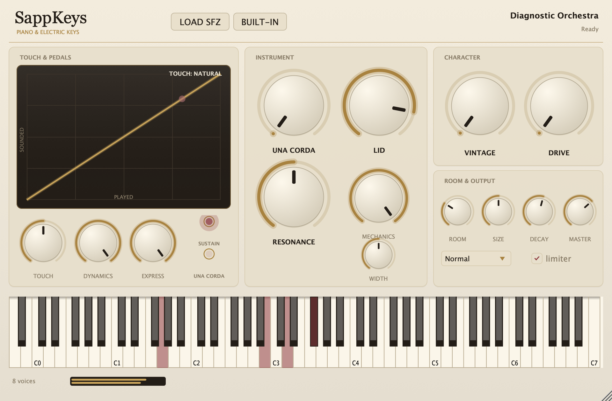

# sappkeys

<!-- UPDATE WHEN: the one-line description changes, or the repo's top-level layout changes -->

Beautiful piano & electric-keys instrument (JUCE Standalone/VST3/AU) built on
the [SappSounds](https://github.com/localteampartners/sappsounds) sample
engine. Salamander grand flagship, free FreePats EP/upright sets, sympathetic
resonance, una corda, lid position, mechanical noises, small-room ambience,
vintage EP character — plus an agent CLI and a SappLink manifest so
MIDI-generation software can play it.

## Quickstart

```bash
# fast loop: core + CLI + tests (no JUCE needed)
./verify.sh

# samples (never committed)
~/apps/sappsounds/scripts/fetch-library.sh get salamander
~/apps/sappsounds/scripts/fetch-library.sh get fm-piano1

# hear it
python3 scripts/make_demo.py demo/gymnopedie.mid
./build/sappkeys render \
  --sfz ~/Samples/salamander/SalamanderGrandPiano-SFZ+FLAC-V3+20200602/SalamanderGrandPiano-V3+20200602.sfz \
  --midi demo/gymnopedie.mid --out demo/gymnopedie.wav \
  --preset concert-grand --param master_gain_db=6 --seed 20260806
```

Full plugin build (Standalone/VST3/AU): see
[_project/RUNBOOK.md](_project/RUNBOOK.md).



## The instrument

- **Touch** — velocity response curve (heavy ↔ light), drawn live in the UI.
- **Pedals** — real CC64 sustain (deferred release samples) waking a
  sympathetic-resonance comb bank; una corda on CC67 (softer strike + felt
  tilt).
- **Body** — lid position (tilt EQ + width), mechanical-noise mix (release
  samples), stereo width.
- **Character** — tape/vintage (per-note random tune, wow & flutter, softened
  highs) and gentle drive for EPs.
- **Room** — short early reflections + a small 6-line FDN. A room, not a hall.

## Agent API

`sappkeys inspect | validate | params | presets | scan | render` — one JSON
document per command, deterministic seeded renders. Contract in
[docs/agent_api.md](docs/agent_api.md); SappLink CC map in
[docs/sapplink.md](docs/sapplink.md).

## Project documentation

All orientation docs live in [`_project/`](_project/) — start with
[_project/README.md](_project/README.md). Agents: read [CLAUDE.md](CLAUDE.md)
first.

## Where releases are built

Tags are built by a **self-hosted GitHub Actions runner on the Windows
machine** (`desktop-14886fp`), not by GitHub's hosted runners — hosted minutes
are billed and the account is currently blocked. Windows jobs read:

```yaml
runs-on: ${{ vars.WINDOWS_RUNNER || 'windows-latest' }}
```

so the repo variable `WINDOWS_RUNNER=self-hosted` sends builds to that
machine, and deleting the variable sends them back to GitHub. No workflow
edits either way.

**Every repo needs its own runner.** The account is a GitHub *user*, not an
organisation, and user accounts can't share runners across repos — so each
repo gets its own registration (its own folder and Windows service) on the
same machine. The prerequisites are installed once and shared: Git, CMake
3.24+, and Visual Studio 2022 Build Tools with the "Desktop development with
C++" workload.

Full setup, including the per-repo registration steps:
[sapptune/RUNNER.md](https://github.com/localteampartners/sapptune/blob/master/RUNNER.md).

**Builds are Windows-only** — macOS jobs were removed on 2026-08-08.
